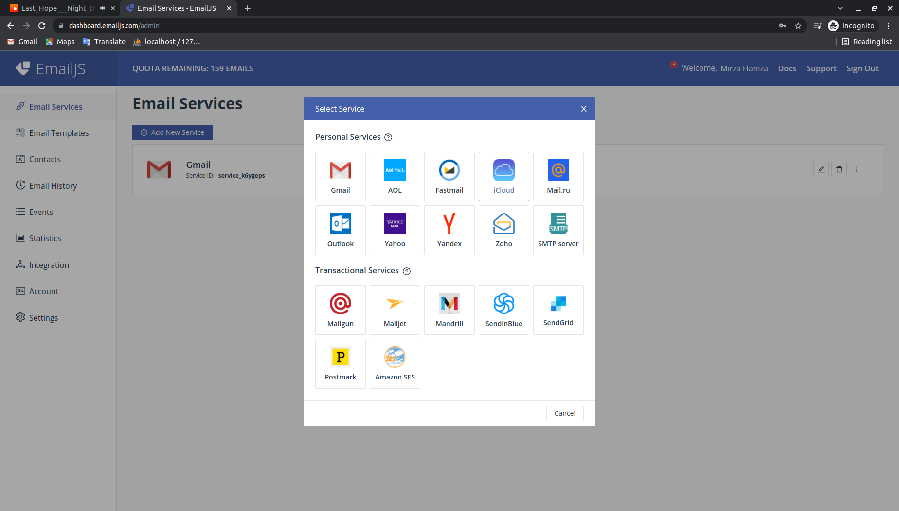

Before start the project Plase make few changes in config.json file in src folder

# 1- change SIDE_URL variable with your own url

login your suiteCrm and copy the browser url

before /index.php?

e.g. (http://localhost/suiteCrm)/index.php?

copy the braket url

# 2- change USER_ID in ACCESS_TOKEN_DATA

you can find user_id by creating new user.

new user can be create by going to admin then user management and in left side you can see Create New User tab.

after create user you can copy the user id from browser url

like this record=(11f8fb56-ff6f-73b8-3a51-620125576f00) Copy after the record=

and replace with USER_ID in config file

# 3- change USER_SECRET in ACCESS_TOKEN_DATA

during creating new user in step 2 you can set user_secret

after set user_secret replace it with USER_SECRET in config file

enable email verification using emailJs

setup steps

# //

# Please Note. you can only use 200 per month mail request from EmailJs account

(https://www.emailjs.com/pricing/)

# //

# Creating EmailJs account

1- Click on the link and create a free account on EmailJs (https://dashboard.emailjs.com/sign-up)

2- After creating Select the service you want to start with from dashboard

select the service you want to use. This mail is use as From send By to receiver.

3- When you select service you see service_id copy this id and replace it in /src/config.json file with SERVICE_ID in MAIL_DATA object

# Creating mail template

1- In your EmailJs dashboard click on Email Templates -> Create New template. Setup your template name and id.

2- You can use curly braces for the fields that will receive data from react code as shown below. I have made "To email" field dynamic.

3- You can configure the template as per your requirement. Please follow as it is in bellow pic.

4- After creating template copy the temp_id and replace it in /src/config.json file with TEMP_ID in MAIL_DATA object

5- you can also change the body of mail by replacing MESSAGE in MAIL_DATA object in /src/config.json file

# setup in React

1- find the user id from EmailJs dashboard click on Integration. you can see user id in API KEYS in the end

2 - replace the copied user id from EmailJs to /public/index.html in react. In index.html file replace it in Script tag. you can see in pic below.

# Installation complete. READY TO GO
